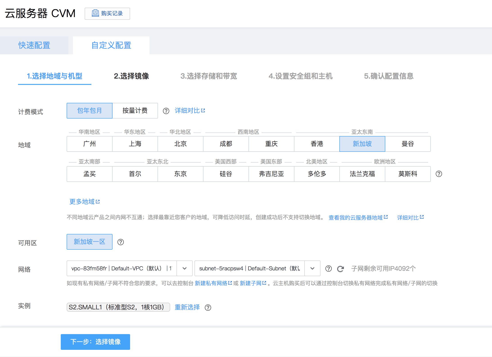
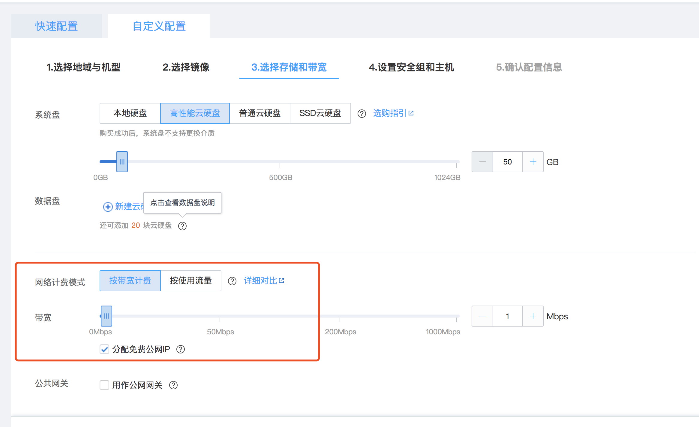
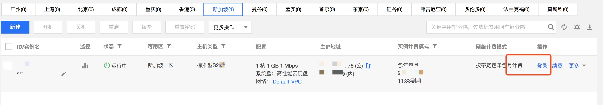

> 基于腾讯云服务器，搭建SSR 服务，实现电脑、平板、手机多端科学上网。

由于个人对谷歌搜索、谷歌学术、Youtube 等站点存在一定的访问需求，而由于大家都懂的原因，国内无法访问这些网站，腾讯云之前活动赠送的优惠券还没用完，于是基于腾讯云的服务器，尝试搭建SSR 科学上网服务。

## 1. 腾讯云服务器的申请
账号注册登陆后，选择“云产品”——“计算”——“云服务器”，点击：“新建服务器实例”，选择如下所示：

注意: 
  1. 地域选择“香港”、“新加坡”等境外地址；
  2. 实例选择标准型S2，1核1GB 即够用；
  3. 镜像选择“Centos 7.2 ”及以上；

网络配置选择“按宽带计费”，且选中“分配免费公网IP”。


然后一直默认下一步，设置好账号密码即可。

配置后的服务器实例如下图所示：


## 2.部署SSR 服务
*该部分内容参考：[Google Cloud Platform免费申请&一键搭建SSR & BBR加速教程](https://www.wmsoho.com/google-cloud-platform-ssr-bbr-tutorial/)*

点击实例右侧“登陆”即可登陆腾讯服务器，登陆成功后按下面命令部署ssr 服务。

- 切换当前用户为root 用户
  ```bash
  sudo -i
  ```
- 下载bbr 安装脚本：
  ```bash
  wget --no-check-certificate https://github.com/teddysun/across/raw/master/bbr.sh
  ```
- 给脚本加上可执行权限：
  ```bash
  chmod +x bbr.sh
  ```
- 运行脚本
```bash
  ./bbr.sh
  ```
- 安装成功后重启服务器，
```bash
  uname -r
  ```
- 查看内核版本，如果返回值含有4.13或以上版本, 就表示安装成功了。


